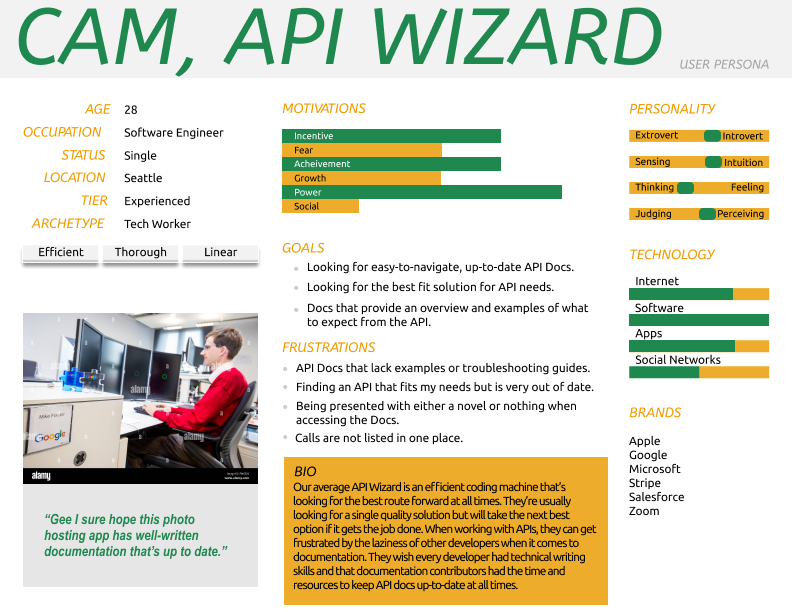
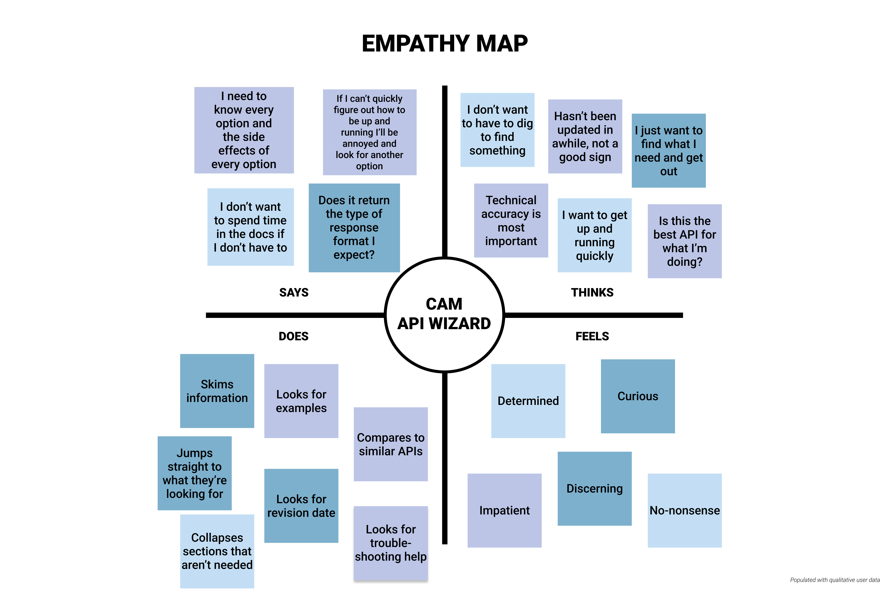
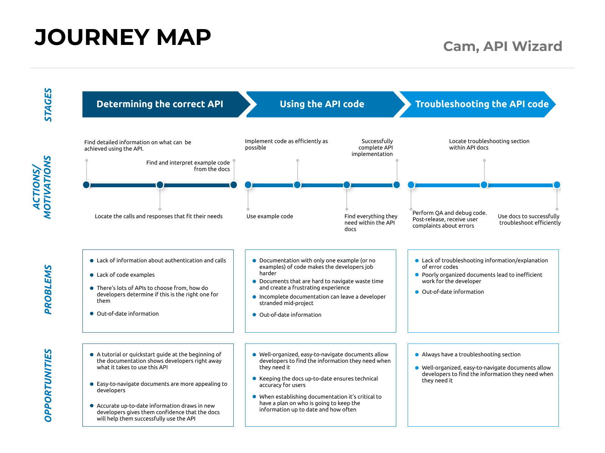

+++
title = 'Starwipe API Documentation Site'
date = 2024-02-06T14:29:06-08:00
showTableofContents = true
weight = 30
draft = false
+++


Starwipe API documentation site



[View project on Github](https://github.com/krimariko/bierut.stoplight.io)

This was my final group portfolio project for the [UW technical writing program](experience#certificate-professional-technical-writinghttpswwwpceuweducertificatesprofessional-technical-writing) which I completed in November 2023.

## Overview
We built a mock API documentation site for an imaginary photo app we invented and named Starwipe.

**Project goals:**
  - Learn how to document REST APIs
  - Create a representation of an API documentation site using industry tools and processes

**Timeframe:** 9 weeks

**Method:**
  - Interview software engineers to understand API documentation needs
  - Design a simple REST API following the [OpenAPI specification](https://www.openapis.org/)
  - Use documentation tool to render OAS spec
  - Complete with supporting Markdown articles to add context to the API reference
  - Deploy with Stoplight

Aside from some initial content drafting in Google Docs, we built and deployed the site entirely with [Stoplight](https://stoplight.io/).

Stoplight's [API design editor](https://meta.stoplight.io/docs/platform/48mdongfx9bug-open-api-design-elements) simplified the process of defining our API and enabled us to create an OAS spec with minimal hand coding.

I worked with 5 other students on this project. It was an ambitious undertaking that required extensive background research and rapid learning. We came into the project with minimal knowledge of APIs and faced a steep learning curve. I worked through a large chunk of Tom Johnson's [API documentation course](https://idratherbewriting.com/learnapidoc/) to get myself up to speed and found it an invaluable resource.

Beyond our research on REST APIs, a crucial part of our learning was talking to our target audience, software engineers. This step was hugely informative and enabled us to define a set of documentation best practices that set the shape and direction of the final product.

## User research: What developers had to say about API documentation
We talked to software developers about what they look for in good API documentation. Some pretty common themes surfaced regarding best practices and pain points. We gathered a working list of documentation dos and don'ts and from there built a persona of our target user and mapped out their documentation user journey.

### Interview questions
We gathered responses from a total of 9 developers using a combination of live interviews and Google form polling. We sourced the participants from our personal contacts.

1. Have you worked with APIs before? (all yes)
2. When and why would you seek out API documentation?
3. What is the first thing you look for in API documentation?
4. What is something you frequently find you need in API documentation, but often discover is missing?
5. What distinguishes good API documentation from poor documentation?
6. Can you think of any examples of good API docs? What makes this example stand out?
7. Are there any immediate telltale signs of bad API documentation? For example, if you were to take a quick glance at an API doc site, is there anything that would make you jump ship immediately?

### Key takeaways
Happily our interviewees pretty much agreed about what sets apart good docs from poor ones.

**Authentication needs to be front and center.** This is critical information that's often hidden or just not included. If users can't figure out how to authenticate, they can't use the API.

   > If I cannot quickly determine how to be up and running using it (auth, make a basic call etc) then I will be annoyed and often look for another solution.

**Docs need to be quick to navigate and skim.** Users don't come to docs to read; they come to find a specific answer to a specific problem. Docs should be easy to navigate, scan, and search so devs can find what they need with minimal hunting.

   > Good API documentation is well organized. I don't want to spend time in the docs if I don't have to.

**Target both new and seasoned users.** Users need the docs for different reasons at each stage of the user journey. Good, thorough docs have both a user guide section (getting started, tutorials, and other conceptual content) and a thorough reference section listing all endpoints.

**Lack of updates or out-of-date info is a big red flag.** Old information means the docs aren't reliable.

**Examples are key.** Lots of examples in a variety of languages means users can get up and running quickly.

**Docs need troubleshooting info.** Developers don't want to spend time debugging the API through trial and error. Docs should provide guidance on errors and solutions.

**Reference section should be comprehensive.** The reference area should contain everything the API offers, with endpoints clearly organized.

   > API is really nothing more than a contract that says, ‘doing x will result in y.’ You really need good documentation to know what to expect.

### Portrait of our target user
Using the findings gathered from our user interviews, we created a persona and empathy map of a typical API doc user and mapped out their documentation user journey.

All research artifacts were created with [Figma](https://www.figma.com/).

#### API user persona

#### Empathy map

#### User journey
